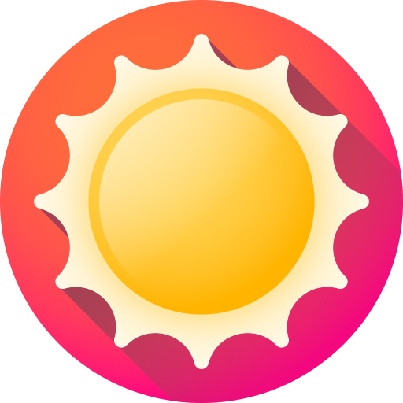
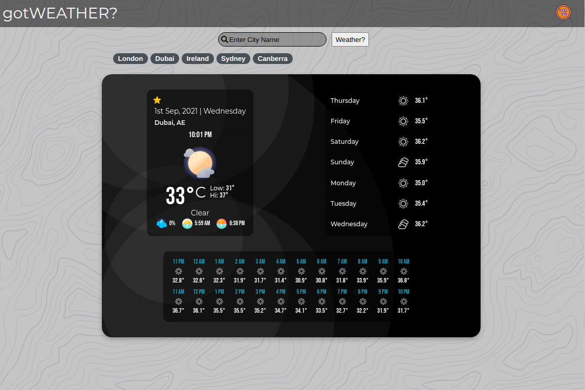
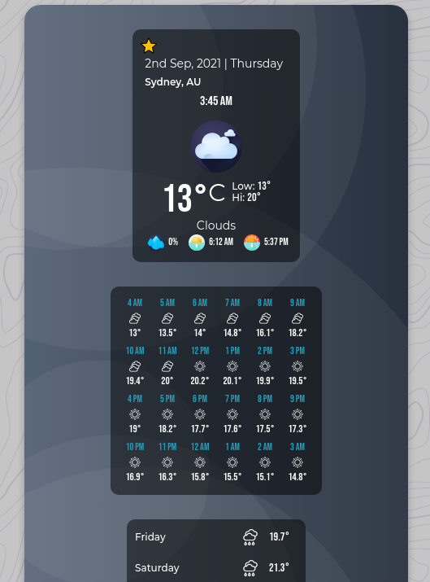
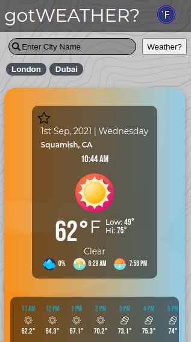
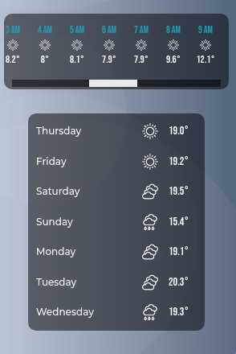
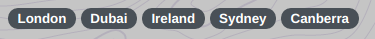
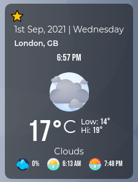
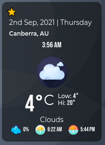

<!--
*** Thanks for checking out the Best-README-Template. If you have a suggestion
*** that would make this better, please fork the repo and create a pull request
*** or simply open an issue with the tag "enhancement".
*** Thanks again! Now go create something AMAZING! :D
***
***
***
*** To avoid retyping too much info. Do a search and replace for the following:
*** craigmclean39, weather-top, twitter_handle, craig.mclean39@gmail.com, Tasky: The Todo List, A Todo list web app that is part of The Odin Project Full Stack Javascript curriculum.
-->

<!-- PROJECT SHIELDS -->
<!--
*** I'm using markdown "reference style" links for readability.
*** Reference links are enclosed in brackets [ ] instead of parentheses ( ).
*** See the bottom of this document for the declaration of the reference variables
*** for contributors-url, forks-url, etc. This is an optional, concise syntax you may use.
*** https://www.markdownguide.org/basic-syntax/#reference-style-links
-->
<!-- [![Contributors][contributors-shield]][contributors-url]
[![Forks][forks-shield]][forks-url]
[![Stargazers][stars-shield]][stars-url]
[![Issues][issues-shield]][issues-url]
[![MIT License][license-shield]][license-url]
[![LinkedIn][linkedin-shield]][linkedin-url] -->

<!-- PROJECT LOGO -->
 

  

  <h3 align="center">gotWeather?</h3>

  

    A Weather app that was created as part of The Odin Project Full Stack Javascript curriculum.
     
    <a href="https://github.com/craigmclean39/weather-top"><strong>Explore the docs »</strong></a>
     
     
    <a href="https://craigmclean39.github.io/weather-top/">View Demo</a>
    ·
    <a href="https://github.com/craigmclean39/weather-top/issues">Report Bug</a>
    ·
    <a href="https://github.com/craigmclean39/weather-top/issues">Request Feature</a>
  

<!-- TABLE OF CONTENTS -->

  
<h2 style="display: inline-block">Table of Contents</h2>

  <ol>
    <li>
      <a href="#about-the-project">About The Project</a>
      <ul>
        <li><a href="#built-with">Built With</a></li>
        <li><a href="#libraries">Libraries</a></li>
        <li><a href="#apis">APIs</a></li>
      </ul>
    </li>
    <li>
      <a href="#getting-started">Getting Started</a>
    </li>
    <li><a href="#features">Features</a></li>
    <li><a href="#contact">Contact</a></li>
    <li><a href="#acknowledgements">Acknowledgements</a></li>
  </ol>

<!-- ABOUT THE PROJECT -->

## About The Project

This weather website was created as an exercise in using APIs to gather data. Experience was gained in calling APIs, parsing JSON, and utilizing JavaScript promises. I utilized the Async / Await method of dealing with Promises to create clean, readible code. All errors are caught in one easy to handle catch. Currently errors are just gracefully ignored, no error messages are displayed at present.

### Built With

- [JavaScript](https://developer.mozilla.org/en-US/docs/Web/JavaScript)
- [CSS](https://developer.mozilla.org/en-US/docs/Web/CSS)
- [Webpack](https://webpack.js.org/)

### Libraries

- [date-fns](https://date-fns.org/)
- [date-fns-tz](https://www.npmjs.com/package/date-fns-tz)

### Apis

- [OpenWeatherMap API](https://openweathermap.org/api)

<!-- GETTING STARTED -->

## Getting Started

Take a look at the demo <a href="https://craigmclean39.github.io/weather-top/">here.</a>

<!-- USAGE EXAMPLES -->

## Features

gotWeather? currently has the following features:

- Display the current weather for the city searched for. This includes temperature, daily hi and low temperatures, the weather condition (cloudy, rainy, etc.), the probability of precipitation, and sunrise and sunset times.

  
  

- Display hourly forecast for the next 24 hours. Currently hourly temperature along with a condition icon are displayed.

- Display daily forecast for the next 7 days. Like the hourly forecast I'm currently displaying the daily temperature and an icon for the weather condition.

  

- The user can add or remove a city from a list of favorites. Favorites are displayed under the search bar and offer the user a shortcut to viewing weather at that location. On page load the first city in their favorites list is displayed.

  

- Display different icons and background gradients for various weather conditions, and toggle the icon and gradient between a day and night version depending on the time of day.

  
  

- Time is displayed as the proper time for the timezone of the city.

- User can toggle between celsius and fahrenheit units.

<!-- CONTACT -->

## Contact

Craig McLean - craig.mclean39@gmail.com

Project Link: [https://github.com/craigmclean39/weather-top](https://github.com/craigmclean39/weather-top)

<!-- ACKNOWLEDGEMENTS -->

## Acknowledgements

- [The Odin Project](https://www.theodinproject.com/)
- [Flaticon](https://www.flaticon.com/)
- [Google Fonts](https://fonts.google.com/)
- [Gradient Magic](https://www.gradientmagic.com/)
- [Google Fonts](https://fonts.google.com/)
- [Hero Patterns](https://www.heropatterns.com/)
- [Dribbble](https://dribbble.com/)
